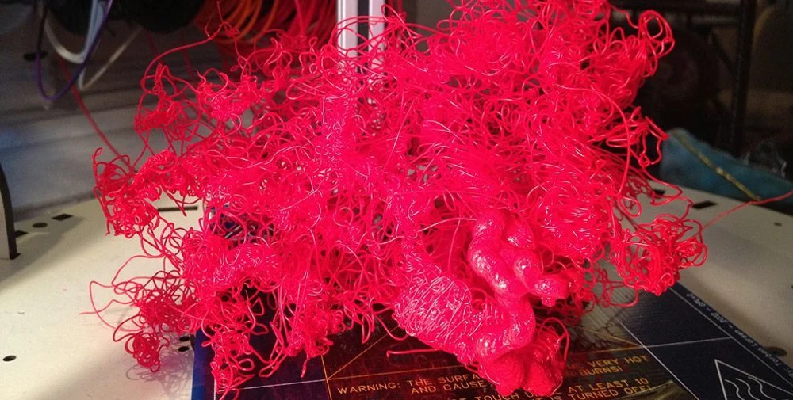

# 🤖 DeepOctoPrint 🤖 (- Data Collector only - WIP)

([source](https://www.pinterest.ca/pin/287174913714717323/))

---

## TLDR
You own a 3D Printer? You're using OctoPrint? Your printer is equipped with a camera? You want to help in develop a deep nerual network to detect failing 3D prints without looking at your printer all the time? You're willing to donate frames of your camera to a public dataset?

Then you're the **right** person. Please install the plugin and help us to make a better world! (just kidding, I'm just tired of failing prints in an overnight print).

You can download the plugin [here](https://addlinkhere)

## ~~TLDR~~ Slightly longer version

Are you tired of failed prints during the night? Tired of clogging, spaghetti, warping and objects not sticking to the bed? 

> ### ***I am!*** 

I started to look for object vision based solutions to monitor my prints or open datasets to train my own model without any success. There are several projects available like [The Spaghetti Detective](https://www.thespaghettidetective.com/), [Kronos Data Collector](https://github.com/MrBreadWater/project-kronos-data-collector), etc. but I was searching for a more open and extensible approach to solve this problem. But unfortunately everything starts with a **good** dataset 😣. I labeled a few hundred pictures of my beloved Prusa MK3S and trained several models to detect certain edge cases which worked out quite well but I want to find a generalized solution which can be used accross the 3D-Printing community. So let me just start with some core **tenets** of this project:
- Everything will be **open-source**!
- The dataset is crowdsourced and licensed as [**ODbL**](https://opendatacommons.org/licenses/odbl/1-0/index.html)
- Labeling of the data will be crowssourced, too.
- I'm very open for **contributors**, feel free to reach out to me, create a PR, create an issue, whatever necessary to make this project successful!

***Okay, but what is this project actually doing?***

Currently there is nothing more then a data collector, implemented as **OctoPrint** plugin, which takes a picture every **x**-seconds and sends it to a remote API. The code itself is pretty messy and subject to be improved (*feel free to leave a PR!*).

***TLDR:*** *Where can I download the plugin?*

**WIP**: The plugin is not yet published, I'm working on it...

## Table of contents 📋

* [Table of contents](#table-of-contents)
* [FAQ](#faq)
* [How to get started with the code](#how-to-get-started-with-the-code)
* [Roadmap](#roadmap)
* [Contributors](#Contributors)

## FAQ ⁉️

> **Where will my data be stored?**

The collected data will be stored Frankfurt (DigitalOcean)

> **What happens if I'm accidentially naked in front of my 3D printer?**

The collected images will be *cleaned* in a unsupervised fashion. I'm using a simple model to detect human-beings and NSFW content within the pictures (and delete them...)

> **But why can't I see any machine learning models in this repository? 😱**

For now only the data collector plugin is available because as you know - every good model starts with a good dataset 😝

> **Hmm, when I install the data collector, what will happen with the pictures?**

By installing and enabling the plugin, you agree to publish the images to the public licensed as [**ODbL**](https://opendatacommons.org/licenses/odbl/1-0/index.html). The data collection is anonymously and the data will be kept indefinitely.

> **Where can I find the pictures in this repository which I published yesterday?**

The dataset will be cleaned and distributed at least once a month.

> **I want my data to be deleted because I printed** ***xxx*** **which I don't like to be part of a public dataset?**

The plugin writes a unique hex to your octoprint.yaml configuration file. Feel free to create an issue as fast as possible (before I publish the new version of the dataset) to get your data cleaned.

> **Why is the plugin licensed as GNU AFFERO GENERAL PUBLIC LICENSE Version 3?**

Because I borrowed some code from the Spaghetti Detective plugin (nice work btw!)

> **Why has this README so many spelling and grammar issues?**

Sorry, it is late and I'm not a native speaker - feel free to create a PR (*please*)...

> **How can I be added in the list of contributors?**

You're contributing to the dataset by using the collector plugin or contributed to the code? Just create a PR and add your name. Wait what - but how are you checking that people are really using the plugin? *I don't and I don't intend to do so!*

> **Will this be a cloud service or what are your plans?**

I intend to create a lightweight model which can be used on Jetson or similar. However at the beginning I will probably experiment with deeper models to find a good baseline.

> **How do you want to make this possible, do you actually have any idea of deep learning?**

Yes I have but this is not subject of this repository. I already explored several approaches using pixel-wise image segmentation to detect the print, the bed and the print head. This helps to detect separations from the print bed, *extereme* clogging and gives us a perfectly trained feature extractor backbone which can be used to explore certain other problems like spaghetti (Which can be easily part of the segmentation itself), warping, etc. I ended up exploring a multi-task learning approach with different losses accross the tasks and different weights for each loss. However this approach was highly complicated but I think it is feasible to use a big network to train a lightweight network in a semi-supervised approach to run it *at the edge*.

> **What framework do you prefer?**

Definitely **PyTorch!** 😍

> **Can I contribute to the project?**

Yes definitely (and I would highly appreciate it)! There are so many topics to work on, just to name a few:
- Improve the code - it has no tests, it's pretty hacky, not documented and maybe not using the right architecture.
- Correct my spelling mistakes. 🙃
- Automate some things (GitHub Actions, Dependabot, ...)
- Make all your friends to install the **collector plugin**
- ... and many more ...

> **What exactly will be tracked?**
- A unique identifier (hex format) which gets generated when you install the plugin the first time and gets stored in the OctoPrint configuration file
- A frame of your webcam
- The time when the print starts

**IMPORTANT:** the plugin only collects data when a print is running!

> **Why is there a MIT license in the project but you mentioned AGPLv3?**

Some parts of the repository are licensed under different licenses and contain separate LICENSE files.
- Data Collector Plugin (AGPLv3) - borrows code from [The Spaghetti Detective](http://thespaghettidetective.com/) (which is a nice project, take a look. The authors also share their public dataset.)
- The dataset itself (**not yet released**) is licensed as [**ODbL**](https://opendatacommons.org/licenses/odbl/1-0/index.html)

## How to get started with the code 🛠️

*to be done, I'm sorry*

## Roadmap 🏄

- [x] Publish the project on GitHub
- [ ] Publish the API
- [ ] Package the plugin and publish it as **OctoPrint** plugin
- [ ] Get this repository somehow spreaded into the world (*This checkbox will never be checked*)
- [ ] Find more contributors (*Same applies here*)
- [ ] Publish the first dataset
- [ ] Improve the Roadmap...

## Contributors ❤️

### Active (code / project contributors)
- [Dennis](https://github.com/dennisbappert)

### Passive (dataset contributors)
- [Dennis](https://github.com/dennisbappert)
